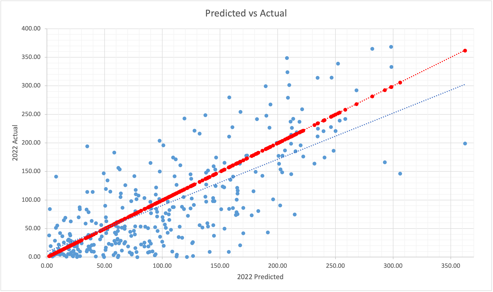
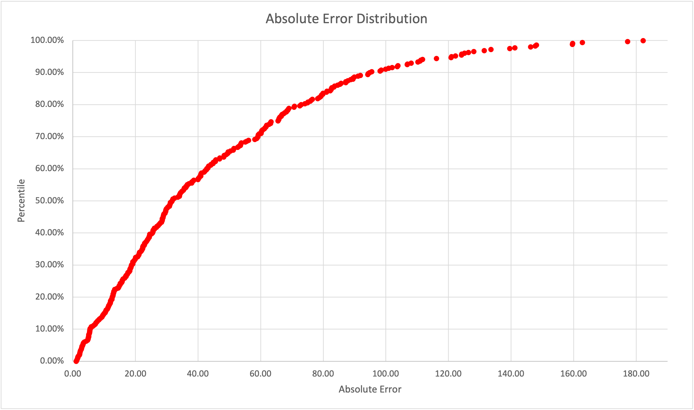

[Photo by Getty Images]

## Introduction

The goal of this project is to accurately predict the season long leaders for the upcoming
2023 fantasy football season. I scraped the career stats of each player in the 2022 scrimmage 
yards table from Pro Football Reference. There are gaps within this model that should be acknowledged 
such as: no rookies are included, offseason team changes aren't accounted for, and depth charts do not 
adjust these projections at all. This article will highlight the process for projecting FLEX positions, 
which includes WR, RB, and TE only. QB projections were made and the process was similar, however 
results will reflect differently from this model. This model also predicts for PPR (Points per reception) scoring.

## What did I use?

| Tools | Functions |  |  |  |  |  |
| --- | --- | --- | --- | --- | --- | --- |
| Python | BeautifulSoup | numpy | pandas | re | requests | sklearn |  
| Excel | graphing |  |  |  |  |  |

## Data

These stats were scraped using a python script that visits each player's hyperlink and pulls their
career data. The stats are cleaned so that for each year the "per game" stats are displayed for
each player. Included in the dataset are the career averages up to the year that is being pulled,
so a player's rookie season will show all zeros. The career average variables have the prefix "c"
and cover all the variables listed below. The full dataset and script can be seen on my [github](https://github.com/ishqup/fantasy-football-projections).

| Variable | Description | Variable | Description |
| --- | --- | --- | --- |
| Year | Season w/ >= 1 game played | Pos | Player position |
| Scrim | Total yards receiving & rushing | TOT TD | Total touchdowns |
| Fmbl | Total fumbles lost | Rec | Total receptions |
| Tgt | Total receiving targets | Att | Total rushing attempts |
| Age | Years old | Rush yds | Total rushing yards |
| Rec yds | Total receiving yards | Y/R | Yards per reception |
| Rec TD | Total receiving touchdowns | Catch% | Total receptions over total targets |
| Rush TD | Total rushing touchdowns | Yards/att | Yards per rush attempt |
| Touch | All events where player touches ball | Y/T | Yards per touch |
| G | Games played | GS | Games where player appeared in starting lineup |

Once all the data was scraped, an additional year was added called "test" which compiled the average
of all years played for each player. The data was split into the training set (all years played so far)
and the test set (the additional test year).

## Linear Regression

For this model, we took a linear regression of the data using sklearn. We used LassoCV to omit the 
variables with multicolinearlity, as well as simplify and improve accuracy of the model. Below you
can see the most influential variables that the model uses to predict season total fantasy points.
Scrim, Rec, and TOT TD having the largest coefficients make sense since yards, receptions, and 
touchdowns are how players are scored throughout the season. We can also see that Age, cG, and cGS
are negative coefficients, which likely represents the regression that players have as they get older.

| Variable | Coefficient | Variable | Coefficient |
|------|-------|------|-------|
| yInt | 93.35 | cCatch% | 0.50 |
| Scrim | 35.90 | cScrim | 0.12 |
| Rec | 18.17 | cY/A | 0.10 |
| TOT TD | 18.02 | Age | -0.48 |
| G | 15.93 | cG | -0.76 |
| GS | 10.14 | Y/T | -1.18 |
| Rec yds | 5.15 | Y/R | -1.92 |
| Yards/att | 2.03 | Fmbl | -2.04 |
| cRec | 1.91 | cGS | -4.87 |
| cTouch | 1.14 |

## Error Checking

I ran the model on the 2021 scrimmage yards data in order to predict the 2022 season and then compared with the
actual 2022 results to check the accuracy of the model. On the graph below, you can see the red line is where
players were projected to perform and the blue data points are where they actually performed. You can see there
is an outlier on the farthest right point which represents Cooper Kupp, although he was coming off an amazing season
and was projected to score the most he ended up getting injured and underperfoming significantly. These predictions assume the
player will not get injured over the season. However, this is the case with a lot of these players as they get injuries 
(minor or major) they will miss games. We can likely attribute that as a possible reason for the actual scores underperforming 
their predictions on average. A lot of players may get more opportunity than expected, which can be opened up by injury
of a starter or unexpected depth chart changes. This graph does not clearly represent each individual case, but we can see 
a trend that generally falls along the regression.

We can see in the absolute error graph below, that about 70% of predictions fell within ~60 points of their actual season 
point total. To get a better idea, each week 70% of players missed their average weekly projection by roughly 3.5 points or less.
That's pretty good, if we go even further we can see 50% of predictions were within ~30 total points or 1.7 points or less weekly.
So our accuracy is relatively decent for how difficult it is to account for injury, depth charts, and matchups within the model.

## Results

You can see the top 20 FLEX predictions for this upcoming season here. There are some clear flaws in the model, however it can still
be used practically to draft your fantasy team. I have mentioned some of the things you should watch out for when relying on my
model previously as well as within the [draft page](https://ishqup.github.io/draft/) and you can compare my rankings directly to ESPN.

| Player | Position | p2023 |
|--------|----------|-------|
| Justin Jefferson | WR | 308.8032848131007 |
| Austin Ekeler | RB | 307.7002250168067 |
| Christian McCaffrey | RB | 294.3958653420757 |
| Tyreek Hill | WR | 291.28095107079866 |
| Davante Adams | WR | 285.927672748234 |
| Stefon Diggs | WR | 279.63147451353217 |
| Cooper Kupp | WR | 273.94299593711617 |
| Josh Jacobs | RB | 272.5971218222333 |
| Travis Kelce | TE | 267.4524777302665 |
| Ja'Marr Chase | WR | 264.53284068961307 |
| A.J. Brown | WR | 261.2954822237257 |
| Derrick Henry  | RB | 260.1676044677475 |
| CeeDee Lamb | WR | 259.89560014653205 |
| Saquon Barkley | RB | 250.33296121832632 |
| Amon-Ra St. Brown | WR | 242.96988695665408 |
| Nick Chubb | RB | 239.16683938408278 |
| Joe Mixon | RB | 233.15358242887862 |
| Jaylen Waddle | WR | 231.37302699219265 |
| DeVonta Smith | WR | 222.3683732232447 |
| Amari Cooper | WR | 220.38315847769508 |
