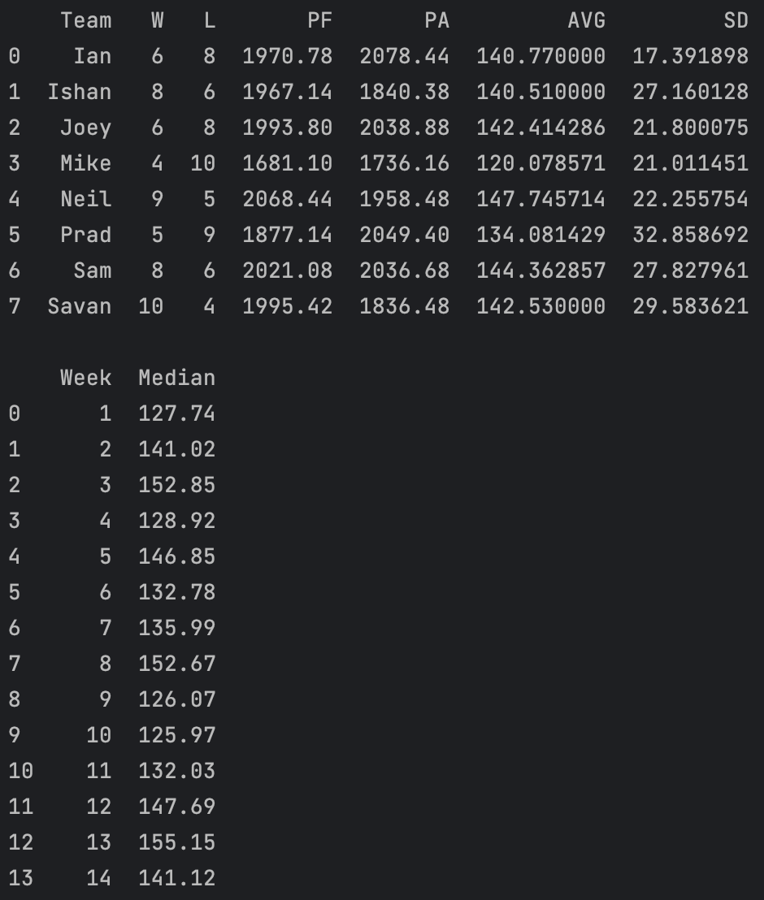
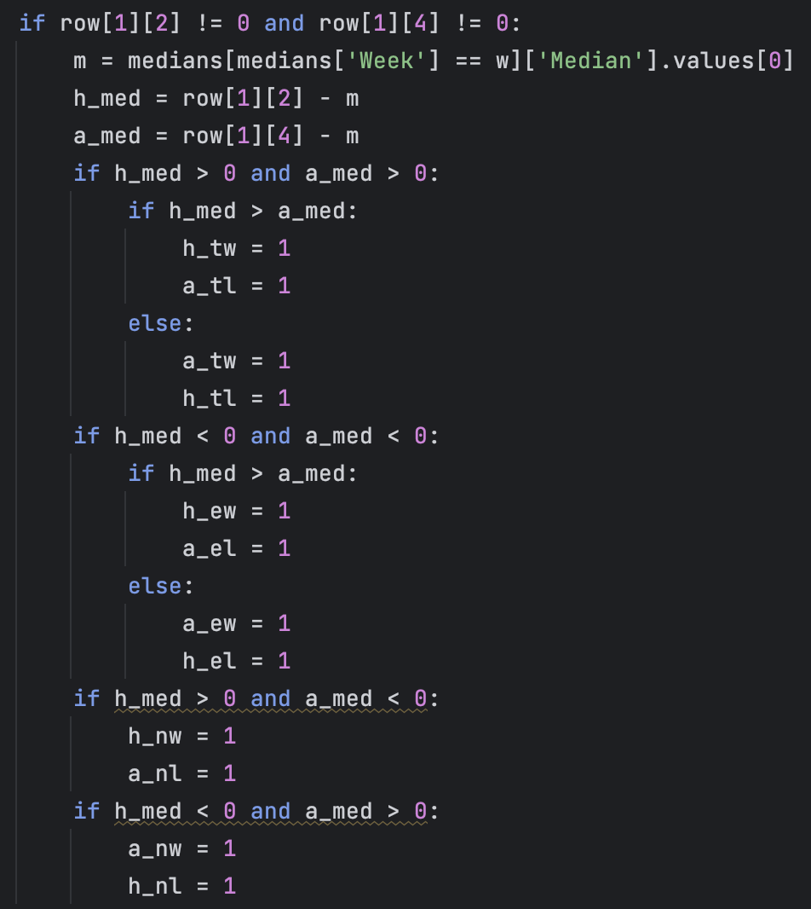
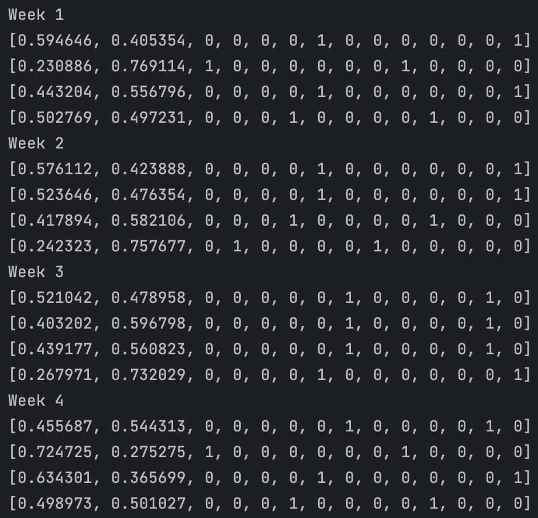
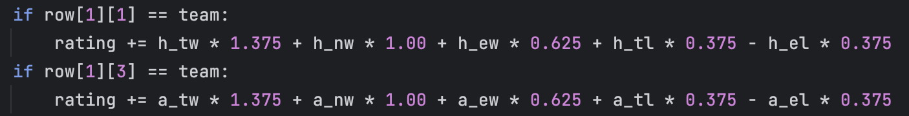

[Photo by Raj Mehta-USA TODAY Sports]

## Introduction

In the history of our Stonks Fantasy League, I have been known to rank teams based on who I think is the best and has the most likely chance to
win the rest of the season. It started with simply looking at every team, their schedule, and ranking them in my notes app. I would send the screenshot
in our groupchat and the trash talk would commence. I started having less time to manually do all the work and started getting more into analytics in
college, utilizing a model that was used to calculate spreads of professional sports games and implementing it with our fantasy football league. However,
after a year or two of using that method we found that it was just a glorified method and was really just ranking us by how much of a difference there
was in our Points For and Points Against. I wanted to make a rating system that would logically rank our teams, based on both past performance and what
their upcoming schedule looked like.

## What did I use?

| Tools | Functions |  |  |  |
| --- | --- | --- | --- | --- |
| Python | numpy | pandas | math | json |

## How does it work?

I had originally been scraping scores directly from ESPN. However, scraping was only working once the season was over and I couldn't find a fix
that would work mid-season. I ended up inputting scores manually in the table below. The full script will be uploaded on 
[github](https://github.com/ishqup/fantasy-football-projections) at a later date.

| Week | Home | HScore | Away | AScore |
| --- | --- | --- | --- | --- |
| 1 | Sam | 136.54 | Prad | 106.14 |
| 1 | Mike | 123.84 | Joey | 86.06 |
| 1 | Savan | 161.6 | Neil | 104.68 |
| 1 | Ian | 131.64 | Ishan | 132.16 |
| 2 | Savan | 167.92 | Prad | 137.9 |
| 2 | Joey | 142.88 | Ian | 139.44 |
| 2 | Ishan | 142.6 | Neil | 152.58 |
| 2 | Mike | 118.04 | Sam | 127.16 |
| 3 | Sam | 149.42 | Joey | 160.78 |
| 3 | Ian | 150.92 | Neil | 154.78 |
| 3 | Prad | 136.08 | Ishan | 211.6 |
| 3 | Mike | 162.56 | Savan | 88.08 |
| 4 | Ian | 127.8 | Sam | 201 |
| 4 | Ishan | 110.58 | Mike | 83.78 |
| 4 | Neil | 190.94 | Prad | 102.52 |
| 4 | Joey | 130.04 | Savan | 173.96 |
| 5 | Sam | 163.26 | Savan | 153.92 |
| 5 | Mike | 91.5 | Neil | 112.96 |
| 5 | Ishan | 139.78 | Joey | 181.64 |
| 5 | Prad | 203.04 | Ian | 113.52 |
| 6 | Ishan | 169.38 | Sam | 92.36 |
| 6 | Prad | 154.34 | Mike | 119.84 |
| 6 | Neil | 133.44 | Joey | 150.62 |
| 6 | Savan | 104.9 | Ian | 132.12 |
| 7 | Savan | 96.16 | Ishan | 126.96 |
| 7 | Neil | 149.48 | Sam | 164.7 |
| 7 | Joey | 143.18 | Prad | 167.16 |
| 7 | Mike | 116.56 | Ian | 128.8 |
| 8 | Prad | 121.24 | Sam | 163.36 |
| 8 | Joey | 147.98 | Mike | 106.78 |
| 8 | Neil | 157.36 | Savan | 159.86 |
| 8 | Ishan | 123.72 | Ian | 180.8 |
| 9 | Prad | 103.1 | Savan | 158.4 |
| 9 | Ian | 164 | Joey | 116.58 |
| 9 | Neil | 144.86 | Ishan | 107.94 |
| 9 | Sam | 118.92 | Mike | 133.22 |
| 10 | Joey | 149.82 | Sam | 110.08 |
| 10 | Neil | 172.26 | Ian | 140.34 |
| 10 | Ishan | 127.82 | Prad | 118.48 |
| 10 | Savan | 124.12 | Mike | 119.48 |
| 11 | Sam | 129.2 | Ian | 162.34 |
| 11 | Mike | 93.64 | Ishan | 160.6 |
| 11 | Prad | 103.98 | Neil | 123.56 |
| 11 | Savan | 146.2 | Joey | 134.86 |
| 12 | Savan | 181.2 | Sam | 128.96 |
| 12 | Neil | 148.14 | Mike | 147.24 |
| 12 | Joey | 146.08 | Ishan | 158.78 |
| 12 | Ian | 130.58 | Prad | 177.32 |
| 13 | Sam | 167 | Ishan | 146.48 |
| 13 | Mike | 124.4 | Prad | 86.4 |
| 13 | Joey | 165.54 | Neil | 166.56 |
| 13 | Ian | 126.46 | Savan | 163.82 |
| 14 | Ishan | 108.74 | Savan | 115.28 |
| 14 | Sam | 169.12 | Neil | 156.84 |
| 14 | Prad | 159.44 | Joey | 137.74 |
| 14 | Ian | 142.02 | Mike | 140.22 |

The only thing needed is the scores for the weeks that have been played, any games that are upcoming can leave scores blank.
The algorithm will look through the game logs and calculate each team's record, points for, points against, average weekly score, and standard
devation of those scores. It will also calculate the median score for each week to be compared to each team later in the code. You can view
the results of these calculations below.

The goal of calculating the average weekly score and the deviation is to account for owner performance. It's almost impossible for me to know
which individual players are injured or on bye and who the owners would sub in for them. It's also impossible for me to analyze each of these player's
schedules and figure out if they're likely to boom or bust from week-to-week. The average score and deviation gives me a good idea of how well a
team is scoring and how much variance is occuring, regardless of the context of that variance. So if owners are experiencing injuries, extreme boom or bust swings,
or just bad team management, it will most likely reflect in these calculations.

I then parse the game log and go through each game, comparing the home and away scores to the median. These games are then marked as
tough wins/losses, neutral wins/losses, and easy wins/losses. A tough game is when both teams are above the weekly median, an easy game is when both teams
are below the median, and a neutral game means opponents are both above and below the median.

The level of toughness of the game is marked accordingly by a 1 within the table indicating both the home and away team's win/loss status. During this
process, the home and away teams also go through a simulation of 1 million games using their average score and devation data. This produces the win
probability that is seen next to the marked wins and losses shown below.

## Cool. That's a lot of yapping, how is the Rating calulated?

The rating is calculated using all of the math discussed previously. To simplify it, it first rates the difficulty of the games you've already played
and uses the formula shown below to add up your score. If your game was considered neutral, a win is a win and you get 1 point. Otherwise you lost, so 
you get 0 points. If your game was tough, a win gives you a little extra boost in the rankings with 1.375 points, but your loss shouldn't be penalized
completely so we still award 0.375 for doing better than the median. Now the same applies for easy wins, you won... but you did worse than the league so
why should you be rewarded? You'll get a partial win with 0.625 points and you really suck if you lose an easy game so you lose 0.375 in rating, which makes
it very possible to go negative on the season. 

Now, what about the games that still haven't been played? Well, that's why we calculated win probabilities. We can use those probabilities to give us a
rough estimate for how many games you're expected to win the rest of the season. It's as simple as just summing all the probabilities of the remaining games.

So, lets say we finished week 10 and I am 6-4. I have 3 neutral wins, 2 tough wins, 1 easy win, 1 neutral loss, 1 tough loss, and 2 easy losses. My rating is calculated
as follows: 3(NW)*1 + 2(TW)*1.375 + 1(EW)*0.625 + 1(NL)*0 + 1(TL)*0.375 - 2(EL)*0.375 = 6.625

Makes sense so far, I have 6 wins and most of them were great games and I was penalized for my 2 bad losses. A 6.625 seems reasonable for my performance.
With 4 games left in the season, I have some easier opponents left. Week 11 Mike (All-time most losses), Week 12 Ian (Eternally mid), Week 13 Sam (Went 2-12),
and Week 14 Savan (Easy rivalry win, no competition). The model outputs my win probabilities for each of those weeks at about 0.79, 0.58, 0.63, and 0.71 respectively.
If we sum those probabilities up, we get my expected wins for the next 4 weeks which is 2.71 wins. If you want to do some analysis, I'm favored in all those games so I could
finish the season at 10-4. However, there's always the chance I lose one or more of those games so if we round up the 2.71 (since there's no partial wins) to 3 then I'm likely to
end the season at 9-5. 

Not bad, so lets factor this into our rating: 6.625 + 2.71 = 9.335

Great! So at 6-4 after week 10, our rating is 9.335. We can likely expect that the model sees us as an above average team that can finish off the season
around 9 wins. That's what I like about the new method I created, it's very interpretable and gives you an idea of where you'll stack up by the end of the season
compared to the rest of the league.

The equation can simply be looked at as: Final Rating = [Past Performance Rating] + [Expected Wins]

It's not perfect, but from my understanding it takes into account the most important factors that determine your standing amongst the league. Your scoring consistency,
how you compare to the rest of the league every week even if you won an easy game or lost a hard game, and does the rest of your schedule allow for you to make a
comeback in the rankings.

You can take a look at our league's current rankings at the top of the [home](/) page.